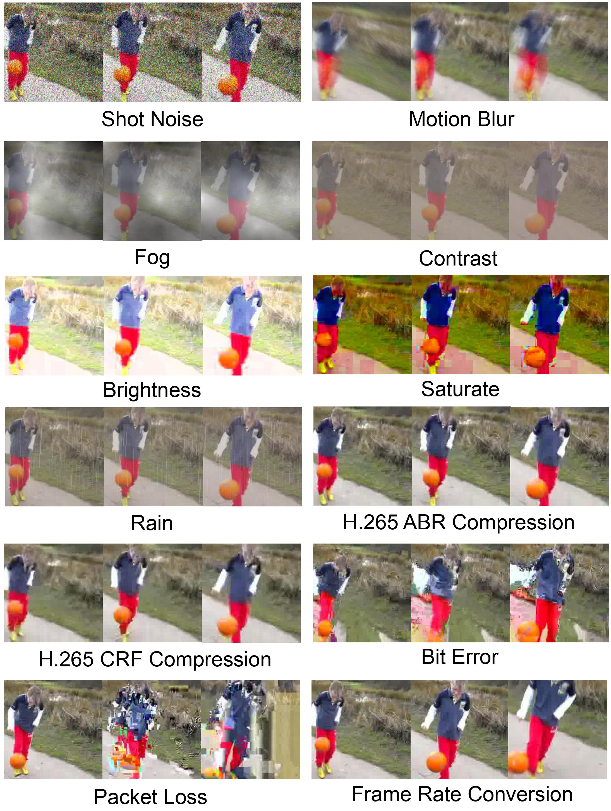
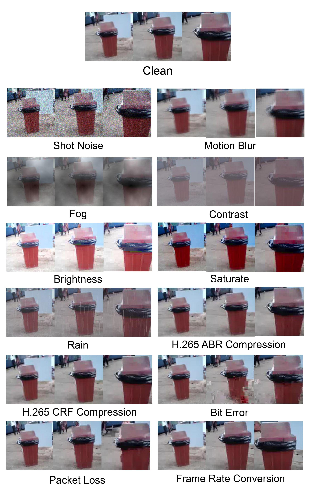

# Benchmarking the robustness of Spatial-Temporal Models

This repositery contains the code for the paper **Benchmarking the robustness of CNN-based Spatial-Temporal Models**.

Python 2.7 and 3.7, Pytorch 1.7+ are required.

## Mini Kinetics-C

Download original Kinetics400 from [link](https://deepmind.com/research/open-source/kinetics).

The Mini Kinetics-C contains half of the classes in Kinetics400. All the classes can be found in [mini-kinetics-200-classes.txt](data/mini-kinetics-200-classes.txt).

## Mini Kinetics-C Leaderboard

Corruption robustness of spatial-temporal models trained on clean Mini Kinetics and evaluated on Mini Kinetics-C.

| Approach | Reference | Backbone | Input Length| Sampling Method | Clean Accuracy |mPC | rPC |
| --- |--- |--- |--- |--- |--- |--- |--- |
|[3D ResNet-50](https://github.com/kenshohara/3D-ResNets-PyTorch)| [K. Hara et al.](https://openaccess.thecvf.com/content_cvpr_2018/html/Hara_Can_Spatiotemporal_3D_CVPR_2018_paper.html)|ResNet-50|32|Uniform|73.0|59.2|81.1|
| [I3D](https://github.com/deepmind/kinetics-i3d)| [J. Carreira et al.](https://arxiv.org/abs/1705.07750)| InceptionV1|32|Uniform|70.5|57.7|81.8|
|[SlowFast 8x4](https://github.com/facebookresearch/SlowFast)| [C. Feichtenhofer at al.](https://arxiv.org/abs/1812.03982) |ResNet-50|32|Uniform|69.2|54.3|78.5|
|[3D ResNet-50](https://github.com/kenshohara/3D-ResNets-PyTorch)| [K. Hara et al.](https://openaccess.thecvf.com/content_cvpr_2018/html/Hara_Can_Spatiotemporal_3D_CVPR_2018_paper.html)|ResNet-18|32|Uniform|66.2|53.3|80.5|
|[X3D-M]((https://github.com/facebookresearch/SlowFast))| [C. Feichtenhofer](https://arxiv.org/abs/2004.04730) |ResNet-50|32|Uniform|62.6|48.6|77.6
|[TAM](https://github.com/IBM/bLVNet-TAM)| [Q.Fan et al.](https://arxiv.org/abs/1912.00869) |ResNet-50|32|Uniform|

For fair comparison, it is recommended to submit the result of approach which follows the following settings:
Backbone of ResNet-50, Input Length of 32, Uniform Sampling at Clip Level.

## Mini SSV2-C

Download original Something-Something-V2 datset from [link](https://20bn.com/datasets/something-something).

The Mini SSV2-C contains half of the classes in Something-Something-V2. All the classes can be found in [mini-ssv2-87-classes.txt](data/mini-ssv2-87-classes.txt).

## Mini SSV2-C Leaderboard

Corruption robustness of spatial-temporal models trained on clean Mini SSV2 and evaluated on Mini SSV2-C.

| Approach | Reference | Backbone | Input Length| Sampling Method | Clean Accuracy |mPC | rPC |
| --- |--- |--- |--- |--- |--- |--- |--- |
| [I3D](https://github.com/deepmind/kinetics-i3d)| [J. Carreira et al.](https://arxiv.org/abs/1705.07750)| InceptionV1|32|Uniform|58.5|47.8|81.7|
|[3D ResNet-50](https://github.com/kenshohara/3D-ResNets-PyTorch)| [K. Hara et al.](https://openaccess.thecvf.com/content_cvpr_2018/html/Hara_Can_Spatiotemporal_3D_CVPR_2018_paper.html)|ResNet-50|32|Uniform|57.4|46.6|81.2|
|[TAM](https://github.com/IBM/bLVNet-TAM)| [Q.Fan et al.](https://arxiv.org/abs/1912.00869) |ResNet-50|32|Uniform|61.8|45.7|73.9|
|[3D ResNet-50](https://github.com/kenshohara/3D-ResNets-PyTorch)| [K. Hara et al.](https://openaccess.thecvf.com/content_cvpr_2018/html/Hara_Can_Spatiotemporal_3D_CVPR_2018_paper.html)|ResNet-18|32|Uniform|53.0|42.6|80.3|
|[X3D-M]((https://github.com/facebookresearch/SlowFast))| [C. Feichtenhofer](https://arxiv.org/abs/2004.04730) |ResNet-50|32|Uniform|49.9|40.7|81.6|
|[SlowFast 8x4](https://github.com/facebookresearch/SlowFast)| [C. Feichtenhofer at al.](https://arxiv.org/abs/1812.03982) |ResNet-50|32|Uniform|48.7|38.4|78.8|

For fair comparison, it is recommended to submit the result of approach which follows the following settings:
Backbone of ResNet-50, Input Length of 32, Uniform Sampling at Clip Level.

